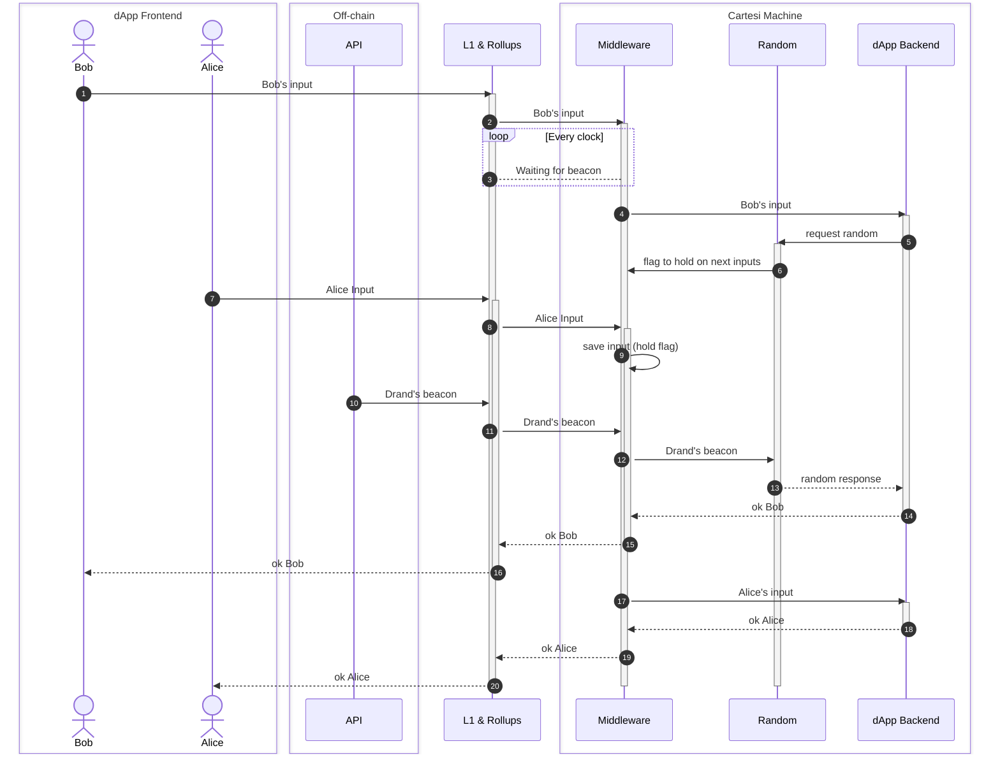

# Cartesi Drand


## Description

This project is the implementation of the proposal: [Drand for Cartesi](https://governance.cartesi.io/t/tooling-drand-for-cartesi/127/13)

Drand enables us to offer pseudo random numbers to Cartesi DApps in a simple manner.

[Drand](https://drand.love/) is a distributed randomness beacon daemon written in Golang. Linked drand nodes collectively produce publicly verifiable, unbiased and unpredictable random values at fixed intervals using bilinear pairings and threshold cryptography. Drand is used by various projects such as [Filecoin](https://filecoin.io/), The League of Entropy and Heliax.

## System requirements
- Rust ^1.7.0


## Building middleware
### From source
1. Install rust with for least 1.70.0 with rollup. https://www.rust-lang.org/tools/install


## Building Dapp contract
### Host mode
Self container middleware:
You can use sunodo to compile using Docker.
Install sunodo follow this steps: https://docs.sunodo.io/guide/introduction/installing

### Prod mode




Bob initiates a new random number process by sending an input to the Cartesi Rollups. The frontend is unaware of whether the DApp backend inside the Cartesi Machine will require a random number. As needed, the DApp backend will request a random number from the Random Server. The Random Server will then signal the Convenience Middleware to hold all subsequent inputs until the beacon arrives.

The Convenience API will periodically inspect the Cartesi Machine to check if there are any inputs awaiting a beacon. When the Convenience API detects an input waiting for a random number, it will request the latest beacon from the Drand network and send it to the Cartesi Rollups.

The Random Server will calculate the creation time of the beacon by subtracting a safe number of seconds to prevent any prior knowledge of the beacon by the user. Within this safe time, it will load the pending random requests sent before that timestamp and respond with a generated seed. Finally, the DApp will receive that seed to generate a random number.

When an input backend execution requesting a random number arrives, it will force any subsequent inputs (whether they require a random number or not) to be stored until the next Drand beacon arrives. This rule ensures the correct sequence of input execution.

We know that the user’s DApp calls the rollup server, we change the arrow direction to make the problem easier to think about. In reality, DApps will call our middleware and our middleware will call the rollup server.

The DApp’s owner can run an instance of the Convenience API to provide this random number functionality.

## Middleware

The middleware provides 2 endpoints

**/finish**
Replace the Rollup's finish endpoint with this one. Example: http://localhost:8080/finish

**/random?timestamp=[timestamp]**
Call this one to get a seed from Drand. Example: http://localhost:8080/random?timestamp=1692129529
It will return 404 when the seed isn't available.


## How to run

- add instructions to self hosted

With sunodo instance :
```shell
```
Start the middleware:
```shell
cd convenience-middleware/
cargo run
```

Start the drand-provider:
```shell
cd convenience-drand-provider/
npm ci && npm run dev
```

Run this smoke test:
```shell
export TIMESTAMP=`date +%s`
curl http://localhost:8080/random?timestamp=${TIMESTAMP}
sleep 10
curl http://localhost:8080/random?timestamp=${TIMESTAMP}
sleep 10
curl http://localhost:8080/random?timestamp=${TIMESTAMP}
```

Run the DApp contract
```shell
export MIDDLEWARE_HTTP_SERVER_URL=http://localhost:8080
cd dapp-contract-blackjack/
cargo run
```

New player:
```shell
cd frontend-console
yarn start input send --payload "{\"input\":{\"action\":\"new_player\",\"name\":\"Bob\"}}"
yarn start input send --payload "{\"input\":{\"action\":\"new_player\",\"name\":\"Alice\"}}" --accountIndex 1
```

List games:
```shell
curl http://localhost:5005/inspect/%7B%22input%22%3A%7B%22action%22%3A%22show_games%22%7D%7D
```


Join game:
```shell
cd frontend-console
export GAME_ID=1
yarn start input send --payload "{\"input\":{\"action\":\"join_game\",\"game_id\":\"${GAME_ID}\"}}"
yarn start input send --payload "{\"input\":{\"action\":\"join_game\",\"game_id\":\"${GAME_ID}\"}}" --accountIndex 1
```

Change middleware drand public key: (see env for account)
```shell
cd frontend-console
export MIDDLEWARE_PUBLIC_KEY="0x83cf0f2896adee7eb8b5f01fcad3912212c437e0073e911fb90022d3e760183c8c4b450b6a0a6c3ac6a5776a2d1064510d1fec758c921cc22b0e17e63aaf4bcb5ed66304de9cf809bd274ca73bab4af5a6e9c76a4bc09e76eae8991ef5ece45a"
yarn start input send --payload "{\"input\":{\"action\":\"update_drand\",\"public_key\":\"${MIDDLEWARE_PUBLIC_KEY}\", \"genesis_time\": 1692803367}}" --accountIndex 19
```


Start game:
```shell
cd frontend-console
yarn start input send --payload "{\"input\":{\"action\":\"start_game\",\"game_id\":\"${GAME_ID}\"}}"
```

Hit:
```shell
cd frontend-console
yarn start input send --payload "{\"input\":{\"action\":\"hit\",\"table_id\":\"${GAME_ID}\"}}"
yarn start input send --payload "{\"input\":{\"action\":\"hit\",\"table_id\":\"${GAME_ID}\"}}" --accountIndex 1
```

Stand:
```shell
cd frontend-console
yarn start input send --payload "{\"input\":{\"action\":\"stand\",\"table_id\":\"${GAME_ID}\"}}"
yarn start input send --payload "{\"input\":{\"action\":\"stand\",\"table_id\":\"${GAME_ID}\"}}" --accountIndex 1
```

Show hands:
```shell
cd frontend-console
curl http://localhost:5005/inspect/%7B%22input%22%3A%7B%22action%22%3A%22show_hands%22%2C%22game_id%22%3A%22${GAME_ID}%22%7D%7D
```

Show winner:
```shell
export TABLE_ID=1
yarn start input send --payload "{\"input\":{\"action\":\"show_winner\",\"table_id\":\"${TABLE_ID}\",\"game_id\":\"${GAME_ID}\"}}"

curl http://localhost:5005/inspect/%7B%22input%22%3A%7B%22action%22%3A%22show_winner%22%2C%22game_id%22%3A%22${GAME_ID}%22%2C%22table_id%22%3A%22${TABLE_ID}%22%7D%7D
```

Call player timeout:
```shell
cd frontend-console
yarn start input send --payload "{\"input\":{\"action\":\"timeout\",\"game_id\":\"${GAME_ID}\"}}"
```
All players who are delayed for more than 3 minutes will be in the `stand` state.

## Production Mode


```shell
docker compose -f ../docker-compose.yml -f ./docker-compose.override.yml up
```

```shell
yarn start input send --payload "{\"input\":{\"action\":\"new_player\",\"name\":\"Bob\"}}"
yarn start input send --payload "{\"input\":{\"action\":\"new_player\",\"name\":\"Alice\"}}" --accountIndex 1

echo "Join"
export GAME_ID=1
yarn start input send --payload "{\"input\":{\"action\":\"join_game\",\"game_id\":\"${GAME_ID}\"}}"
yarn start input send --payload "{\"input\":{\"action\":\"join_game\",\"game_id\":\"${GAME_ID}\"}}" --accountIndex 1

echo "Start"
yarn start input send --payload "{\"input\":{\"action\":\"start_game\",\"game_id\":\"${GAME_ID}\"}}"

echo "Hit"
yarn start input send --payload "{\"input\":{\"action\":\"hit\",\"game_id\":\"${GAME_ID}\"}}"
yarn start input send --payload "{\"input\":{\"action\":\"hit\",\"game_id\":\"${GAME_ID}\"}}" --accountIndex 1
```
