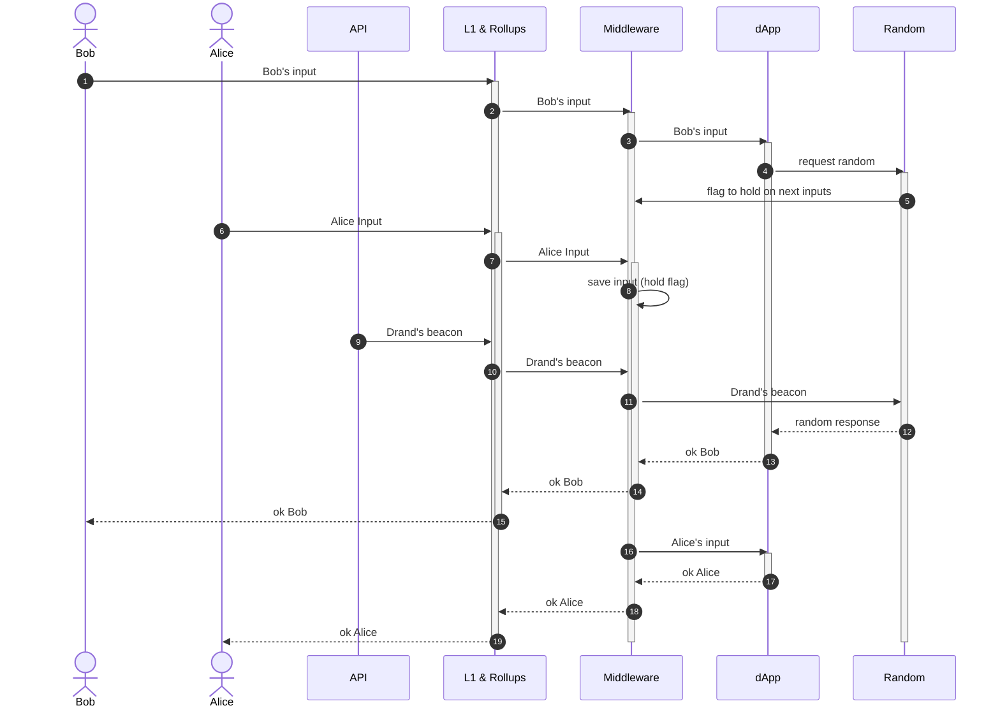

# Cartesi Drand

```mermaid
sequenceDiagram
    autonumber
    actor Bob
    actor Alice
    participant API
    participant L1 & Rollups
    participant Middleware
    participant dApp
    participant Random

    Bob->>L1 & Rollups: Bob's input
    activate L1 & Rollups
    L1 & Rollups->>Middleware: Bob's input
    activate Middleware
    Middleware->>dApp: Bob's input
    activate dApp
    dApp->>Random: request random
    activate Random
    Random->>Middleware: flag to hold on next inputs
    Alice->>L1 & Rollups: Alice Input
    activate L1 & Rollups
    L1 & Rollups->>Middleware: Alice Input
    activate Middleware
    Middleware ->> Middleware: save input (hold flag)
    API->>L1 & Rollups: Drand's beacon
    L1 & Rollups->>Middleware: Drand's beacon
    Middleware->>Random: Drand's beacon
    Random-->>dApp: random response
    dApp-->>Middleware: ok Bob
    deactivate dApp
    Middleware-->>L1 & Rollups: ok Bob
    deactivate Middleware
    L1 & Rollups-->>Bob: ok Bob
    deactivate L1 & Rollups
    Middleware->>dApp: Alice's input
    activate dApp
    dApp-->>Middleware: ok Alice
    deactivate dApp
    Middleware-->>L1 & Rollups: ok Alice
    L1 & Rollups-->>Alice: ok Alice
    deactivate Random
    deactivate Middleware
    deactivate L1 & Rollups
```
