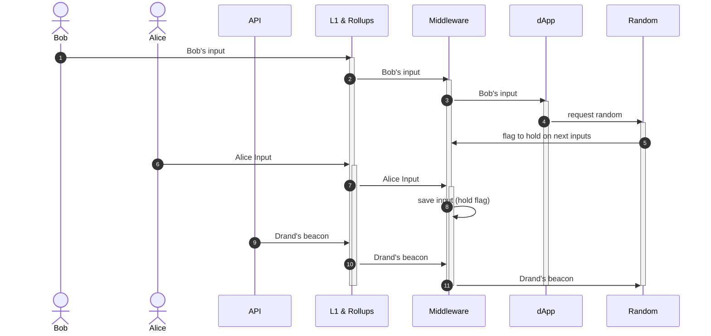

# Cartesi Drand

```mermaid
sequenceDiagram
    autonumber
    actor Bob
    actor Alice
    participant API
    participant L1 & Rollups
    participant Middleware
    participant dApp
    participant Random

    Bob->>L1 & Rollups: Bob's input
    activate L1 & Rollups
    L1 & Rollups->>Middleware: Bob's input
    activate Middleware
    Middleware->>dApp: Bob's input
    activate dApp
    dApp->>Random: request random
    activate Random
    Random->>Middleware: flag to hold on next inputs
    Alice->>L1 & Rollups: Alice Input
    activate L1 & Rollups
    L1 & Rollups->>Middleware: Alice Input
    activate Middleware
    Middleware ->> Middleware: save input (hold flag)
    API->>L1 & Rollups: Drand's beacon
    L1 & Rollups->>Middleware: Drand's beacon
    Middleware->>Random: Drand's beacon

    deactivate Random
    deactivate Middleware
    deactivate dApp

    deactivate L1 & Rollups

    deactivate Middleware
    deactivate L1 & Rollups
```
