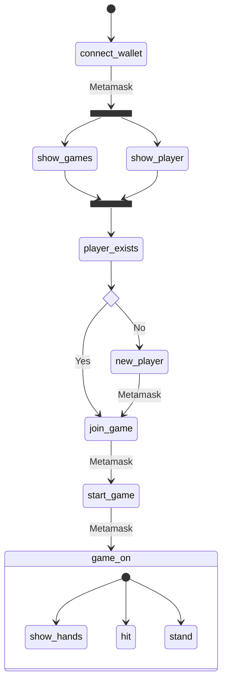

```mermaid
stateDiagram-v2
    state "connect_wallet" as W
    state player_exists
    state retrieve <<fork>>
    state ready <<join>>
    state if_state <<choice>>

    state "new_player" as NP
    state "join_game" as JG
    state "show_player" as GET_PLAYER
    state "show_games" as GET_GAME
    state "start_game" as START_GAME
    %% state "stop_game" as STOP_GAME
    state "show_hands" as SH
    state "hit" as H
    state "stand" as ST

    [*] --> W
    W --> retrieve: Metamask

    retrieve --> GET_GAME
    retrieve --> GET_PLAYER

    GET_GAME --> ready
    GET_PLAYER --> ready

    ready --> player_exists
    player_exists --> if_state
    if_state --> NP: No
    if_state --> JG: Yes
    NP --> JG: Metamask
    JG --> START_GAME: Metamask
    START_GAME --> game_on: Metamask

    state game_on {
        [*] --> H
        [*] --> ST
        [*] --> SH
    }
```
