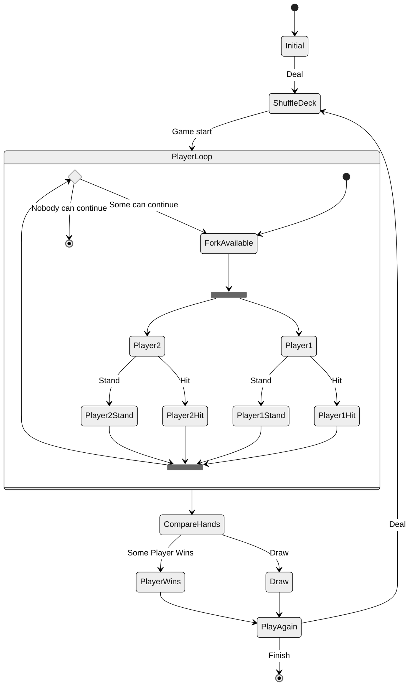

# Blackjack

Example of two players:

```mermaid
%%{init: {'theme':'neutral'}}%%
stateDiagram-v2
    [*] --> Initial
    Initial --> ShuffleDeck : Deal
    ShuffleDeck --> PlayerLoop  : Game start

    state PlayerLoop {
        state WhoIsAvailable <<choice>>
        state PhaseInitial <<fork>>
        [*] --> ForkAvailable
        ForkAvailable --> PhaseInitial

        PhaseInitial --> Player1
        Player1 --> Player1Hit : Hit
        Player1 --> Player1Stand : Stand


        PhaseInitial --> Player2
        Player2 --> Player2Hit : Hit
        Player2 --> Player2Stand : Stand


        %% PhaseInitial --> Player3
        %% Player3 --> Player3Hit : Hit
        %% Player3 --> Player3Stand : Stand

        state PhaseWait <<join>>

        Player1Hit --> PhaseWait
        Player2Hit --> PhaseWait
        %% Player3Hit --> PhaseWait

        Player1Stand --> PhaseWait
        Player2Stand --> PhaseWait
        %% Player3Stand --> PhaseWait

        PhaseWait --> WhoIsAvailable
        WhoIsAvailable --> ForkAvailable: Some can continue
        WhoIsAvailable --> [*]: Nobody can continue
    }

    PlayerLoop --> CompareHands

    CompareHands --> PlayerWins : Some Player Wins
    CompareHands --> Draw : Draw
    PlayerWins --> PlayAgain
    Draw --> PlayAgain
    PlayAgain --> ShuffleDeck : Deal
    PlayAgain --> [*] : Finish
```
